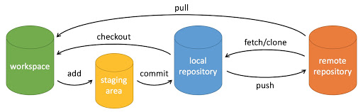

Git是什么---一个版本管理工具
[Git - 安装 Git](https://git-scm.com/book/zh/v2/%E8%B5%B7%E6%AD%A5-%E5%AE%89%E8%A3%85-Git)
Github是什么---基于Git，云端的，可多人协作的代码仓库
https://github.com/

.gitignore

一些常用的git命令：
```bash
git init
git add
git commit [-amend] [--no-edit]

git tag [-a] <标签名> <状态> [-m] <标签描述>

git log --oneline
git status

git remote
git push

git clone
git pull
```



## git bundle
C语言实训课上学生提到的，这个命令平常比较少见，是用于离线打包本地仓库的。通常是离线打包之后拷贝给别人让别人可以同步你的文件状态，但是无法共享，所以并不方便。


## Pull Request
